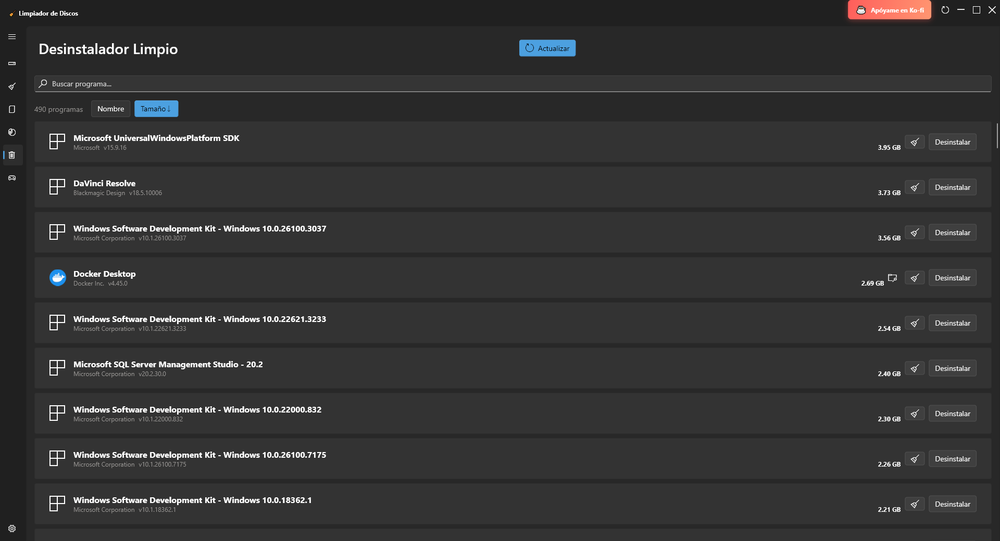
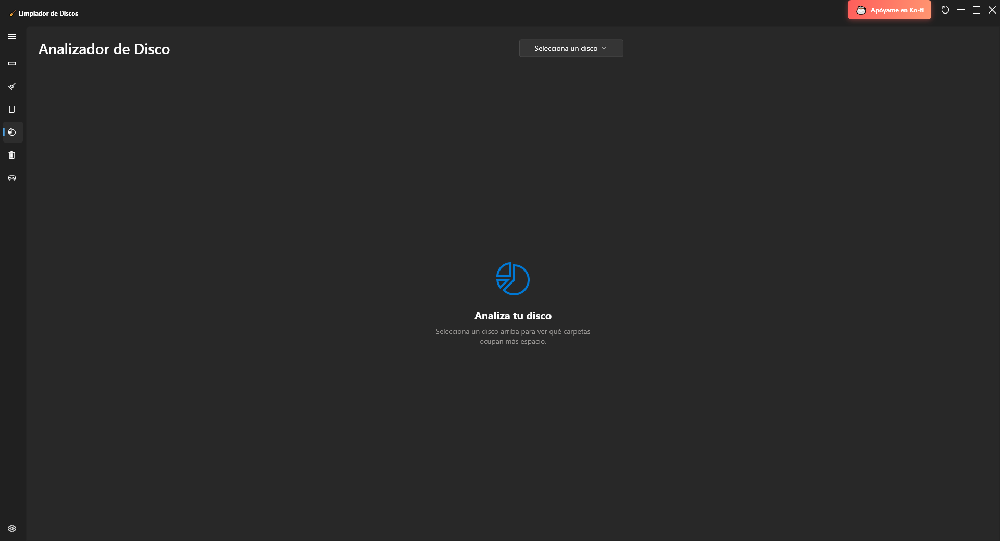
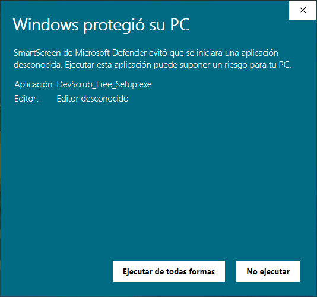

# DevScrub - Releases

  
  
  

## 🧹 ¿Qué es DevScrub?

**DevScrub** es una herramienta de limpieza de disco optimizada para **desarrolladores y gamers**. Libera espacio eliminando cachés de herramientas de desarrollo y gestiona tus juegos instalados.

### ✨ Características principales

- 🧹 **Desinstalador Limpio**: Elimina apps sin dejar rastro. Detecta archivos huérfanos que los desinstaladores normales olvidan.
- 🐳 **Limpieza de Docker**: Elimina imágenes, volúmenes y contenedores sin usar.
- 📦 **Cachés de desarrollo**: npm, Gradle, Maven, pip, Bun y más.
- 🎮 **Gestor de Juegos**: Detecta instalaciones de Steam, Epic Games, EA y Amazon Games.
- 🔧 **Reparación de Steam**: Verifica integridad de archivos de juegos.
- 🖥️ **Interfaz moderna**: Diseño Fluent UI nativo de Windows 11.

---

## 📥 Descargar

Descarga la última versión desde la sección [**Releases**](../../releases/latest).

| Versión | Descripción | Descarga |
|---------|-------------|----------|
| **DevScrub Free** | Versión gratuita con trial de 60 días para funciones Pro | [Descargar](../../releases/latest) |
| **DevScrub Pro** | Versión completa sin restricciones | [Comprar en Ko-fi](https://ko-fi.com/s/3477e1ca5d) |

---

## 🖥️ Requisitos del Sistema

- Windows 10/11 (64-bit)
- 100 MB de espacio en disco
- Conexión a internet (solo para verificar actualizaciones)

---

## 📸 Capturas de pantalla

- **Inicio**:
  

- **Limpieza del Sistema**:
  

- **Gestor de Juegos**:
  

- **Desinstalador Limpio**:
  

- **Analizador**:
  

---

## ⚠️ Solución de problemas

### "Windows protegió su PC" (SmartScreen)

Al ejecutar el instalador, Windows puede mostrar una advertencia de SmartScreen. Esto es **normal** para aplicaciones nuevas que aún no tienen una reputación establecida.

**Para continuar con la instalación:**

1. Haz clic en **"Más información"**
2. Luego haz clic en **"Ejecutar de todos modos"**

📷 Ver captura de pantalla

Después de hacer clic en "Más información", verás el botón "Ejecutar de todos modos":

> **Nota:** Si prefieres evitar este aviso, puedes adquirir la versión Pro desde la [Microsoft Store](#) (próximamente), la cual está firmada digitalmente por Microsoft.

---

## 🤝 Soporte

¿Encontraste un bug o tienes una sugerencia?

- 💬 [Reportar un problema](../../issues)
- ☕ [Apoyar el proyecto en Ko-fi](https://ko-fi.com/neomatrixcode)

---

## 📜 Licencia

Este software es **freeware**. La versión Free incluye un periodo de prueba de 60 días para las funciones Pro.

---

  Hecho con ❤️ por <a href="https://ko-fi.com/neomatrixcode">Neomatrix</a>

